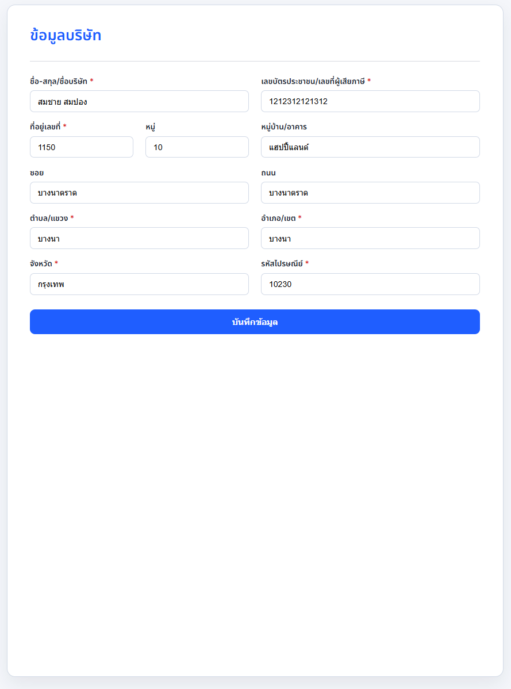

# Employee Register Web App

Modern Node.js + PostgreSQL web app for Login, Registration, and Company Info. The backend is an Express API and the frontend is static HTML/CSS/JS served from `public/`.

## Tech Stack

- Node.js 18+, Express, `pg`, `bcrypt`, `dotenv`
- PostgreSQL (SQL migration files in `sql/`)
- Static HTML/CSS/JS 

## Features

- Login page (เข้าสู่ระบบ) with show-password toggle and validation
- Register page (สมัครสมาชิก) with password checklist and full profile fields
- Company Info page (ข้อมูลบริษัท) with read/update via API
- Passwords hashed with bcrypt; environment-driven DB connection

## Project Layout

- `public/index.html` – redirects to the new Login page
- `public/login.html` – Login UI (Thai copy, success → redirects to Company Info)
- `public/register.html` – Registration UI (Thai copy + password rules)
- `public/user-info.html` – Company Info UI (open with `?userId=<id>`)
- `src/server.js` – Express server and static hosting
- `src/routes/auth.js` – `POST /api/auth/login`, `POST /api/auth/register`
- `src/routes/users.js` – `GET/PUT /api/users/:id`
- `sql/init.sql` – creates `employees` table
- `sql/add_company_info_columns.sql` – adds profile columns for older databases

## Prerequisites

- Node.js 18+
- PostgreSQL 14+ and `psql`

## Setup

1) Install dependencies

```bash
npm install
```

2) Configure environment

Copy the example and edit values:

- PowerShell: `Copy-Item .env.example .env`
- Bash: `cp .env.example .env`

`.env` (example):

```
DATABASE_URL=postgresql://postgres:<password>@localhost:5432/employee_db
PGSSL=false
PORT=3000
```

3) Create the database and schema

```sql
-- inside psql
CREATE DATABASE employee_db;
\c employee_db
\i sql/init.sql
-- if upgrading an existing database:
\i sql/add_company_info_columns.sql
```

## Run

```bash
npm run dev
```
Open `http://localhost:3000/` (redirects to Login).


Login (เข้าสู่ระบบ)


Create account (สร้างบัญชี)


Account detail (ข้อมูลบริษัท)



Direct URLs:

- `http://localhost:3000/login.html` – เข้าสู่ระบบ
- `http://localhost:3000/register.html` – สมัครสมาชิก
- `http://localhost:3000/user-info.html?userId=<id>` – ข้อมูลบริษัท (requires id from login)

## API (Summary)

- `POST /api/auth/login` – authenticate, returns `{ employee: { id, username, firstName, lastName } }`
- `POST /api/auth/register` – create account (payload comes from Register page)
- `GET /api/users/:id` – fetch company profile for the given id
- `PUT /api/users/:id` – update company profile fields

## Troubleshooting

- SASL “client password must be a string” → set a real password in `.env` `DATABASE_URL`, then restart the server.
- `relation "employees" does not exist` → run `\i sql/init.sql` (and `\i sql/add_company_info_columns.sql` if upgrading) in `psql` on the target DB.
- `psql` not recognized on Windows → add PostgreSQL `bin` to PATH (e.g. `C:\Program Files\PostgreSQL\15\bin`) or open the “SQL Shell (psql)” app.

## Notes

- Pages are static; the login script redirects to the Company Info page with `?userId=<id>` on success.